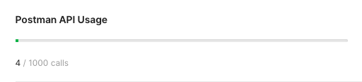

# Postman을 사용하여 API spec 관리

- Postman OpenAPI를 이용한 my account's collection upload & update
- Github에 Collection 및 Environment  동기화

모든 사용자는 각자 postman account 를 이용

## Set up

### Postman API-Key 발급

postman OpenAPI를 사용하기 위한 키값을 발급 받는다. 

[Postman API](https://learning.postman.com/docs/developer/intro-api/)

quator : 1000/month



⇒ 한 달에 개인이 1000번이상 api spec이 변경할 일이 없을 것 같아서, 괜찮다고 생각이 드네요..

## Usage

```
export_collection.sh [collectionName] [collectionId] [apiKey] [output]
```
### Arguments
- collectionName : collection's alias
- collectionId : collection id (user's own collection id)
- apiKey : postman user's api key
- output : output path & file

## Details

동작은 2가지를 포함한다. 

- export collection : postman cloud에 업로드된 데이터를 json으로 export한다.
- push json file to git repo : export 된 json을 현재 repo에 푸시한다.

## reference

[Importing and exporting data](https://learning.postman.com/docs/getting-started/importing-and-exporting-data/#importing-postman-data)

[postmanlabs/postman-collection-transformer](https://github.com/postmanlabs/postman-collection-transformer)
